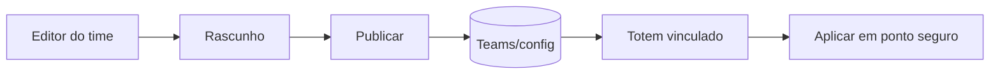

# Admin E Publicacao

## Responsabilidade

O painel em `apps/admin` gerencia rede, times, dispositivos, vendas, fotos e configuracao visual. Alteracoes de time sao publicadas para o runtime do kiosk.

## Arquivos

- Aplicacao atual: `apps/admin/src/App.tsx`.
- Tipos e helpers: `apps/admin/src/lib/`.
- Preview compartilhado: `src/shared/kiosk-ui/`.
- Configuracao consumida: `src/contexts/TeamContext.tsx`.
- Operacoes de dispositivo: Edge Functions `poll-kiosk-commands`, `report-kiosk-health` e migrations relacionadas.

## Invariantes

- Preview usa os mesmos componentes do kiosk.
- Operador comum nao gerencia usuarios/roles.
- Segredos nao aparecem na UI.
- Publicacao nao deve reiniciar sessao ativa.

## Verificacao

`npm run check:admin`; mudancas compartilhadas com UI do kiosk tambem usam `npm run check:kiosk`.

