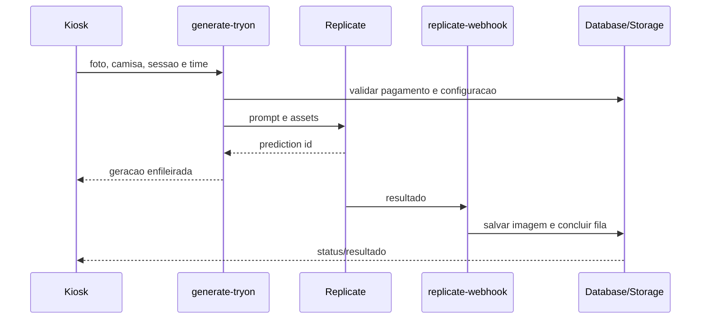

# Fluxo De Geracao IA

## Arquivos

- Inicio e progresso: `src/pages/Kiosk.tsx`, `src/hooks/useQueueSubscription.ts`.
- Prompt/modelo: `supabase/functions/generate-tryon/index.ts`.
- Conclusao: `supabase/functions/replicate-webhook/index.ts`.

## Invariantes

- Cenario pode ser fixo e invisivel no frontend.
- Resultado atual usa proporcao configurada pelo produto.
- Regra de pessoas deve estar no prompt; nao aplicar recorte destrutivo no cliente.
- Webhook e polling nao podem concluir a mesma geracao duas vezes.

## Verificacao

Snapshots de payload/prompt e `npm run check:functions`; teste real consome Replicate e deve ser consciente.

