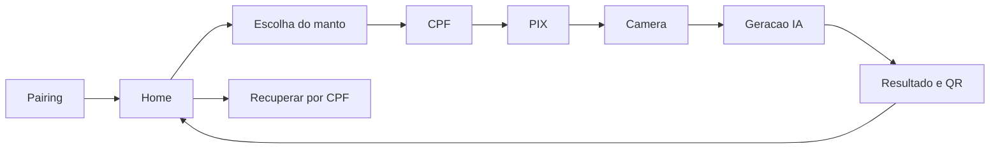

# Fluxo Do Kiosk

## Responsabilidade

O Electron abre `/kiosk`. `Kiosk.tsx` carrega configuracao local/remota, conduz a sessao e renderiza componentes de `src/shared/kiosk-ui`.

## Arquivos

- Orquestracao: `src/pages/Kiosk.tsx`.
- Configuracao de time: `src/contexts/TeamContext.tsx`.
- Utilitarios: `src/lib/kiosk.ts`, `src/lib/cpf.ts`.
- UI: `src/shared/kiosk-ui/`.
- Janela/configuracao local: `electron/main.cjs`.

## Invariantes

- O time e fixo por instalacao, mas pode ser trocado remotamente.
- Atualizacoes remotas aguardam um ponto seguro; nao interrompem sessao em andamento.
- Pagamento confirmado conduz a camera mesmo com webhook atrasado, desde que a confirmacao seja valida.
- Resultado gera QR de entrega e finalizacao limpa a sessao.
- Recuperacao por CPF consulta somente fotos do mesmo totem e janela permitida.

## Verificacao

`npm run check:kiosk`; camera real e atualizacao exigem Electron no Windows.

