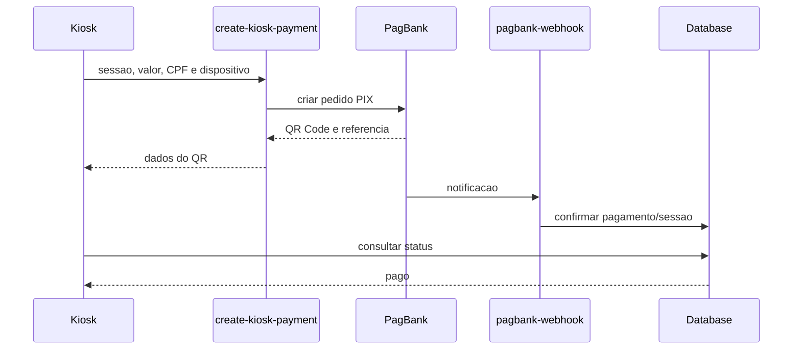

# Fluxo De Pagamento PIX

## Arquivos

- UI/orquestracao: `src/pages/Kiosk.tsx`.
- Criacao: `supabase/functions/create-kiosk-payment/index.ts`.
- Confirmacao: `supabase/functions/pagbank-webhook/index.ts`.
- Schema: migrations de `kiosk_payments`, `kiosk_sessions` e CPF.

## Invariantes

- Apenas PIX no modo normal.
- Valor vem da configuracao publicada do time, mas backend valida a sessao.
- CPF nao deve aparecer em logs.
- Tela de pagamento nao expira voltando para Home depois de o usuario pagar.
- Webhook deve ser idempotente.

## Verificacao

Teste de contrato em sandbox/laboratorio e `npm run check:functions`. Producao exige credencial e chave PIX validas.

